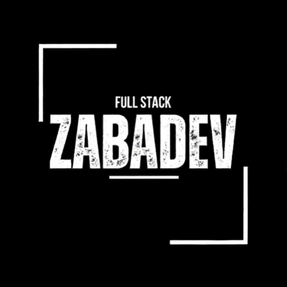

  
  
   

<h1 align="center">
   
  Welcome to the Future of Code 
  
</h1>

<h2 align="center">
  I'm ZaBaDeV
</h2>

  

  
  
  
  

  

 

<h2 align="center">💫 About me</h2>

  

¡Hola a todos! Soy <strong>ZaBaDeV</strong>, un funcionario público en España con más de 20 años de experiencia, formador de programación, apasionado por la tecnología y el desarrollo full stack.  
✌️ &emsp; Disfruto programando y compartiendo conocimiento   
❤️ &emsp; Me encanta escribir código y aprender nuevas tecnologías  
🚀 &emsp; Busco combinar mi trayectoria en la administración pública con mis habilidades técnicas  
💬 &emsp; Pregúntame lo que sea <a href="https://github.com/ZaBaDeV/ZaBaDeV/issues">aquí</a>

 

<blockquote align="center" style="font-size: 1.4em; background: linear-gradient(90deg, #0D1117, #1A2A2A); border-left: 8px solid #00ff88; padding: 25px; border-radius: 15px; box-shadow: 0 0 25px #00ff88;">
  🌟 <strong>"El código es poesía, y yo soy el poeta que escribe en 20+ lenguajes"</strong> — ZaBaDeV
</blockquote>

  ¡Juntos podemos avanzar hacia un futuro tecnológico y lleno de posibilidades!

 

<h2 align="center">🌐 Contact me</h2>

  
  
  
  
  
  

 

<h2 align="center">
   
  <strong>Tech Stack</strong>
</h2>

<strong>🔥 Languages</strong>

  
  
  
  
  
  
  

<strong>🎨 Frontend Development</strong>

  
  
  
  
  
  
  
  

<strong>⚙️ Backend Development</strong>

  
  
  
  
  
  
  
  
  

<strong>📱 Mobile Development</strong>

  
  

<strong>🗄️ Databases</strong>

  
  
  
  

<strong>☁️ Cloud & DevOps</strong>

  
  
  

<strong>🛠️ Tools & Software</strong>

  
  
  
  
  
  
  

<strong>🎨 Design Tools</strong>

  
  
  
  
  
  

<strong>🎮 Game Development & Others</strong>

  
  
  
  

 

<h2 align="center">🏆 GitHub Trophies</h2>

  

<h2 align="center">📊 GitHub Stats</h2>

  

  

  
  

  
  

<h2 align="center">✍️ Random Dev Quote</h2>

  

 

  

Made with ❤️ by ZaBaDeV

